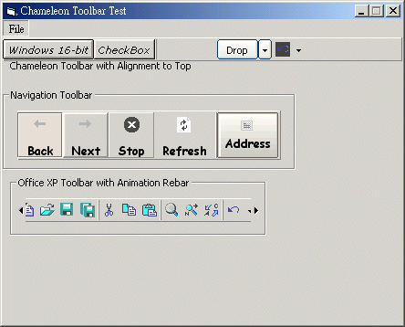



## \[Stylist Toolbar OCX, with all credits to GONCHUKI\] a long waited stuff of all PSCoder\!

### Description

Stylist Toolbar Control OCX! The combination of the best button on PSC, <b>GONCHUKI's

Chameleon Button</b>, and a systematic class toolbar management system. With the

button style of WindowsXP, OfficeXP, Mac, KDE.... and special button style like

DropDown Button, Seperator and CheckBox. Click in and see.........

 
### More Info
 

             |
---                |---
**Submitted On**   |
**By**             |[Kenny Lai, Lai Ho Wa](https://github.com/Planet-Source-Code/PSCIndex/blob/master/ByAuthor/kenny-lai-lai-ho-wa.md)
**Level**          |Advanced
**User Rating**    |4.1 (146 globes from 36 users)
**Compatibility**  |VB 6\.0
**Category**       |[Custom Controls/ Forms/  Menus](https://github.com/Planet-Source-Code/PSCIndex/blob/master/ByCategory/custom-controls-forms-menus__1-4.md)
**World**          |[Visual Basic](https://github.com/Planet-Source-Code/PSCIndex/blob/master/ByWorld/visual-basic.md)
**Archive File**   |

### Source Code

Stylist Toolbar Control OCX! The combination of the best button on PSC, <b>GONCHUKI's
Chameleon Button</b>, and a systematic class toolbar management system. With the
button style of WindowsXP, OfficeXP, Mac, KDE.... and special button style like
DropDown Button, Seperator and CheckBox. Click in and see.........

Hey everyone, here is my hard work, the long-waited stuff, <b>Chameleon
Toolbar</b>, based on <b>GONCHUKI's Chameleon Button</b>. The structure is
mainly based on the Toolbar Control of Microsoft Common Control 6.0. It uses a
Button Class and a Buttons Collection Class to manage the buttons, with a good
property page.

Features

<ol>
 <li>
 
Seperate Chameleon Style for each button(like
 WinXP, OfficeXP, KDE, Mac, JavaMetal...)</li>
 <li>
 
Easy property page (You can of course add
 buttons by code)</li>
 <li>
 
Special Button Style(Button, CheckBox,
 Seperator, PlaceHolder, DropDown)</li>
 <li>
 
Provide button mouse out/over event</li>
 <li>
 
Button status(Pressed, Enabled, Visible)</li>
 <li>
 
Grey Scale Hover Option(the icon change to
 color only when mouse over)</li>
 <li>
 
Animation Rebar</li>
 <li>
 
Special Picture(Embossed, Engraved...)</li>
</ol>

Attention: This code
is based on GONCHUKI's Chameleon Button, but the Toolbar-Buttons Management
system is completely developed by Kenny Lai.

DOWNLOAD
LINKS:

Chameleon
Button by Gonchuki

<a href="http://www.planet-source-code.com/vb/scripts/ShowCode.asp?lngWId=1&txtCodeId=37471">http://www.planet-source-code.com/vb/scripts/ShowCode.asp?lngWId=1&txtCodeId=37471</a>

Chameleon
Toolbar by Kenny Lai

<a href="http://pcseries.sourceforge.net/pscode/ChameleonToolbarOCX.zip">http://pcseries.sourceforge.net/pscode/ChameleonToolbarOCX.zip</a>

¡@

